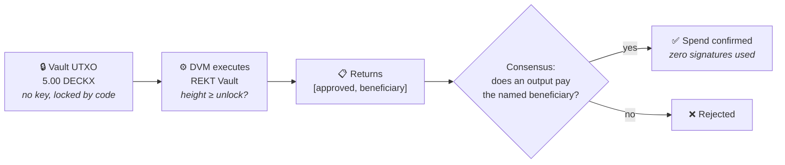
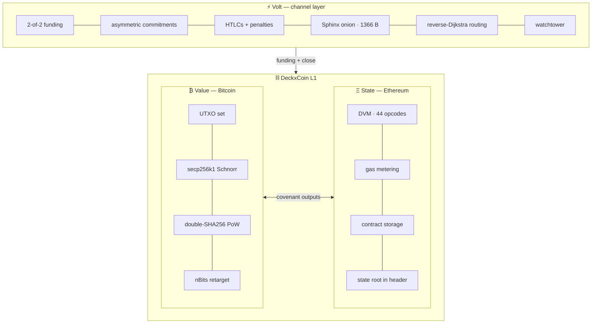

<div align="center">


# DeckxCoin

### Covenant Outputs for a Peer-to-Peer Electronic Cash System

**Bitcoin's UTXO value layer · an Ethereum-style contract layer that holds no balance · a Lightning-style channel network**

[](chain/test)
[](#-running-a-node)
[](#-monetary-policy)
[](#-monetary-policy)
[](#-the-standard-covenant-library)
[](#-the-wallet)
[](#-quick-start)
[](LICENSE)

**[▶ Live site](https://xyb3rpunq.github.io/deckxcoin/)** · **[📄 Whitepaper (PDF)](docs/DeckxCoin-Whitepaper.pdf)** · **[⚙ Design notes](docs/DESIGN.md)** · **[⚖ Compliance](docs/COMPLIANCE.md)**

</div>

---

```
 genesis   000081f3be3827f4e30701ab4ed75563fb610c1735154f4b41b83b8f5c444f00
 mined     real proof of work — not hard-coded — ~65,536 expected attempts
 subsidy   199.77168949 DECKX   (derived from the cap, not chosen)
 halving   every 52,560 blocks  (exactly 365 days at 600s spacing)
 memo      "REKT 02/Aug/2026 Every exit liquidity was once someone conviction"
```

> [!WARNING]
> **Not audited. No live network. DECKX is not available for purchase and has no price.**
> Nothing here is financial, investment, tax, or legal advice. This is a reference implementation
> and a teaching artefact. Do not place value in it.

---

## 💡 The one idea

**Contracts never hold money.**

There is no `balance` field on a contract account — look at `ContractAccount` in
[`chain/src/state.ts`](chain/src/state.ts) and you will not find one. Value sent to a contract
address stays an ordinary UTXO. The only difference is what unlocks it: not a signature, but the
contract answering *"may this specific transaction spend this specific output?"*



### The consensus rule, in full

| # | Requirement |
|:-:|---|
| 1 | The spending transaction must be of kind `call` |
| 2 | Its `contract.target` must equal the locking address |
| 3 | The contract must return a non-zero first word — *approved* |
| 4 | If it returns a second word, some output must pay that address |

**Rule 4 is the one that is easy to miss.** Without it an approval is a bearer token: anyone who
observes a valid approved call can rebroadcast it with the outputs redirected to themselves.
[`chain/test/covenant.test.ts`](chain/test/covenant.test.ts) asserts that attack fails.

The consequence: **reentrancy is not mitigated here, it is absent.** No cross-contract call opcode,
no pooled balance, nothing for a callback to re-enter.

---

## 🏗 Architecture



| Layer | Heritage | Implemented |
|---|---|---|
| **Value** | Bitcoin whitepaper §§2–11 | UTXO set · **BIP-340 Schnorr** · double-SHA256 PoW · 2016-block retarget · 21 M cap · 100-block coinbase maturity · Merkle root + SPV proofs |
| **State** | Ethereum / EVM | 256-bit stack VM (44 opcodes) · persistent storage · gas metering · REVERT · logs · deterministic addresses · `stateRoot` in every header |
| **Speed** | Poon–Dryja · BOLT 2/3/4/11 | 2-of-2 funding · asymmetric commitments · EC-derived revocation keys · HTLCs · penalty sweeps · Sphinx onion · signed invoices · fee-aware pathfinding · **watchtower** |
| **Network** | Bitcoin P2P | Encrypted identity-bound transport · addr gossip · inv/getdata relay · headers sync · **compact block relay** · orphan pool · ban scoring · **SQLite persistence** · **reorg with undo records** · **fee estimation + RBF** · JSON-RPC |

---

## 🚀 Quick start

Requires **Node ≥ 22.18** — native TypeScript type stripping means no build step and no bundler.

```bash
git clone https://github.com/xyb3rpunq/deckxcoin.git
cd deckxcoin/chain
npm install
npm test
```

<details>
<summary><b>CLI commands</b></summary>

```bash
node src/cli.ts genesis     # mine and verify the genesis block
node src/cli.ts verify      # prove genesis is reproducible
node src/cli.ts volt        # routed off-chain payment across two channels
node src/cli.ts scenario    # full 12-step reference run (~2 min of real PoW)
node src/cli.ts mine 50     # mine 50 regtest blocks
node src/cli.ts keygen "your seed phrase"
```

</details>

<details>
<summary><b>Regenerate the website's chain data</b></summary>

```bash
cd chain
node scripts/export-web-data.ts    # runs the scenario, writes web/data/chain.json
cd ..
python docs/build-whitepaper.py    # rebuilds docs/DeckxCoin-Whitepaper.pdf
```

</details>

Three dependencies, all audited and minimal: `@noble/curves`, `@noble/hashes`, `@scure/base`.
Persistence (`node:sqlite`) and encryption (`node:crypto`) ship with Node, so the full node and
its encrypted transport add **zero** dependencies.

---

## 🌐 Running a node

### A local testnet, one command

```bash
cd chain
node scripts/testnet.ts --nodes 3 --interval 5
```

Three nodes, each with its own datadir, P2P port and RPC port. Node 1 mines; the others sync purely
over TCP. Address gossip fills the chain of connections into a mesh, and the status line reports
whether every node agrees on the **state root** — not just the tip hash, which can match while the
UTXO sets differ.

```
11:58:32 node2 peer 127.0.0.1:29001
11:58:34 node1 peer 127.0.0.1:29003
11:58:35 node1 tip 1 2938c5cea89d5325…
11:58:36 node2 tip 1 2938c5cea89d5325…
11:58:36 node3 tip 1 2938c5cea89d5325…
11:58:47 network  heights=[4, 4, 4] converged supply=998.85844745 DECKX
```

### A standalone daemon

```bash
node src/deckxd.ts --network testnet --datadir ./data/a --port 19333 --rpcport 19332 --mine dxc1q…
node src/deckxd.ts --network testnet --datadir ./data/b --port 19334 --rpcport 19335 \
     --connect 127.0.0.1:19333
```

`deckxd` persists to SQLite, so a restarted node resumes at its tip instead of re-syncing.
`SIGINT`/`SIGTERM` close the database cleanly.

### A public node

```bash
sudo ./chain/scripts/deploy.sh --network testnet --gateway --faucet --mine dxc1q…
```

One command on a fresh Debian or Ubuntu box: unprivileged service user, hardened systemd unit,
firewall opened for P2P and the gateway — and **not** for the RPC, which is unauthenticated by
design and can mine, dial anywhere and stop the process. Run it with `--dry-run` first to see the
plan and the exact unit file without touching the machine.

Two extra surfaces come with it, both optional:

| Flag | What it starts |
|---|---|
| `--gateway` | A read-only front end on 8080. Positive allowlist, response cache keyed by method *and* parameters, token bucket per client. This is the only port meant to face the internet. |
| `--faucet` | A rate-limited dispenser at `/faucet`. Refuses to run on mainnet. Generates its wallet at `<datadir>/faucet.key` on first start and prints the address to fund. |

The website's explorer reads a gateway when one is configured in
[`web/data/network.json`](web/data/network.json), and falls back to the bundled snapshot when none
answers — saying which of the two you are looking at, every time. See
[docs/RUNNING-A-PUBLIC-TESTNET.md](docs/RUNNING-A-PUBLIC-TESTNET.md).

### Talking to it

```bash
curl -s localhost:19332 -d '{"method":"getblockchaininfo"}' | jq
curl -s localhost:19332 -d '{"method":"getpeerinfo"}' | jq
curl -s localhost:19332 -d '{"method":"generate","params":{"count":5,"address":"dxc1q…"}}' | jq
curl -s localhost:19332 -d '{"method":"auditsupply"}' | jq
```

<details>
<summary><b>Full RPC surface (21 methods)</b></summary>

| Method | Purpose |
|---|---|
| `getinfo` | node, chain, peer and mempool summary |
| `getblockchaininfo` | height, tip, issuance, supply audit |
| `getbestblockhash` / `getblockhash` | tip hash / hash at a height |
| `getblock` / `getblockheader` | a block or header, active or on a side branch |
| `gettransaction` | from the chain or the mempool |
| `getbalance` / `listunspent` | address balance and its outputs |
| `getcontract` | contract code, storage and guarded value |
| `sendrawtransaction` | validate, pool and relay |
| `submitblock` | submit an externally mined block |
| `generate` | mine locally (regtest/testnet) |
| `getrawmempool` / `getmempoolinfo` | pooled transactions and fee range |
| `getpeerinfo` / `addnode` / `listbanned` | peer management |
| `sync` | request headers from the best-known peer |
| `auditsupply` | verify the UTXO total against cumulative issuance |
| `help` | this list |

Binds to loopback with **no authentication** — by design. A password field would imply this is safe
to expose, and it is not. Reachable RPC belongs behind a proxy that terminates TLS and authenticates.

</details>

### How the node stays correct

| Concern | Approach |
|---|---|
| **Durability** | SQLite via `node:sqlite`, WAL mode. Every block applies inside a transaction — a half-written block is the one failure that silently forks a node. |
| **Reorgs** | Every block writes an **undo record**; disconnecting restores the exact prior state in O(inputs), not by replaying from genesis. After undo, the restored state root is checked against the parent's commitment — if it disagrees, the node stops rather than continue on an unknown chain. |
| **Fork choice** | Most accumulated work, not longest. Losing branches are retained: a branch that loses today can win tomorrow. |
| **Failed reorgs** | If any block on a new branch fails to connect, the whole move is rolled back and the original tip restored. |
| **Depth limit** | Reorgs deeper than the undo window are **refused**, not attempted with missing data. |
| **Mempool** | Transactions from disconnected blocks return to the pool; those in connected blocks leave it; everything is revalidated against the new tip. Skipping this is how a node relays transactions a reorg already invalidated. |
| **Orphans** | Blocks arriving before their parent are held (bounded to 100) and connected when the gap fills. |
| **Misbehaviour** | Ban scoring: 1 for version skew, 10 for protocol violations, 100 for an invalid block or a framing error. A peer that is merely *behind* is never banned — that is how networks partition themselves. |

---

## 👛 The wallet

BIP-39 mnemonic, BIP-32 derivation, and the four things a wallet actually has to get right.

```bash
node scripts/create-funded-wallet.ts --amount 1000 --out ./MY-WALLET.txt
```

| Concern | Approach |
|---|---|
| **A seed a human can write down** | 24 BIP-39 words with a checksum, so a mistyped word is *caught* rather than silently opening a different wallet. |
| **Many addresses from one backup** | `m/84'/9333'/account'/change/index`. The coin type is the P2P port, not a SLIP-44 registration — claiming a registered number for a chain with no network would be squatting. |
| **Finding your coins again** | Gap-limit discovery over both branches. A wallet that stopped at the first empty address would miss funds sent to a gap, which happens routinely. |
| **Not losing the change** | Change goes to a derived address of the same wallet, never reused, and the amount is checked before signing. Dust-sized change is given to the miner rather than littering the UTXO set. |

Every transaction the wallet builds is dry-run through the chain's own validator before being
returned. A wallet that hands you a transaction the network will reject has done nothing useful.

> [!WARNING]
> There is no encrypted keystore. Keys live in memory for the life of the process and are written to
> disk only on an explicit export. That is a real gap, and it is listed as one.

---

## 💰 Monetary policy

**21,000,000 DECKX. Halving every 365 days.** At 600-second spacing that is exactly
`365 × 24 × 6 = 52,560 blocks`.

The initial subsidy is **not a free parameter** — a geometric halving series sums to
`2 × interval × subsidy`, so the cap and the interval over-determine it:

```
MAX_SUPPLY       = 21_000_000 × 100_000_000    = 2,100,000,000,000,000 zaps
HALVING_INTERVAL = 365 × 24 × 6                = 52,560 blocks
INITIAL_SUBSIDY  = MAX_SUPPLY / (2 × INTERVAL) = 19,977,168,949 zaps
                                               = 199.77168949 DECKX

Sum of all 64 eras: 2,099,999,998,972,800 zaps  =  20,999,999.99 DECKX
Headroom under cap:             1,027,200 zaps  =  0.01027200 DECKX
```

That constant is ugly on purpose. Rounding to a tidy `200 DECKX` would issue **21,024,000 DECKX** —
over the cap — and then need a special-cased final era to clip the excess. A discontinuity in the
issuance curve is a consensus edge case that gets exercised exactly once, decades after anyone last
thought about it. The derived constant lands under the cap on its own, exactly as Bitcoin's does.

| Year | Start height | Block subsidy | Cumulative supply | % of cap |
|---:|---:|---:|---:|---:|
| 1 | 0 | 199.77168949 | 10,499,999.99959440 | 50.0000 % |
| 2 | 52,560 | 99.88584474 | 15,749,999.99912880 | 75.0000 % |
| 3 | 105,120 | 49.94292237 | 18,374,999.99889600 | 87.5000 % |
| 5 | 210,240 | 12.48573059 | 20,343,749.99832720 | 96.8750 % |
| 10 | 473,040 | 0.39017908 | 20,979,492.18464160 | 99.9023 % |
| 20 | 998,640 | 0.00038103 | 20,999,979.96752160 | 99.9999 % |
| 35 | 1,787,040 | 0.00000001 | 20,999,999.98972800 | 100.0000 % |
| 36 | 1,839,600 | 0 — *issuance ended* | 20,999,999.98972800 | 100.0000 % |

<sub>Generated by [`chain/scripts/export-web-data.ts`](chain/scripts/export-web-data.ts) — the full 36-era table is on the [live site](https://xyb3rpunq.github.io/deckxcoin/#supply).</sub>

> [!IMPORTANT]
> **The cost of a one-year halving, stated plainly.** This schedule front-loads issuance hard —
> ~50 % of supply exists after one year, ~99.9 % within a decade. Bitcoin reaches the equivalent
> point around 2140. The security budget shifts from subsidy-funded to fee-funded roughly an order
> of magnitude faster, and any real deployment needs a working fee market within a few years, not a
> few decades. This is a genuine trade-off, not a free upgrade.

The cap is **additionally enforced as a consensus rule**, not left as a property of the arithmetic.
The check should never fire; that is precisely why it is cheap insurance.

---

## 📜 The standard covenant library

Five contracts covering the patterns account-model chains implement as custodial token contracts —
implemented here as **spending conditions on outputs** instead.

| Contract | Approves when | Key caveat |
|---|---|---|
| **TimeVault** | height ≥ `unlockHeight` | No cancel path — including for the depositor |
| **Escrow** | buyer/arbiter releases · seller/arbiter refunds · buyer self-refunds after deadline | The arbiter is fully trusted for both outcomes |
| **Vesting** | `released < tranches` and height ≥ `cliff + released × interval` | One tranche per approved spend — fund with equal outputs |
| **MultiSig** | the M-th *distinct* owner approves | Approvals never expire and cannot be revoked |
| **AtomicSwap** | preimage revealed, or timeout passed | Revealing the preimage publishes it to everyone |

Every spec publishes its storage layout, its exact approval conditions, and **at least two caveats** —
enforced by a test. A contract whose author has found no caveats has not looked hard enough.

<details>
<summary><b>Why contracts are written as assembled fragments</b></summary>

Raw DVM opcodes are miserable to write — the stack order of `SSTORE` alone (value, *then* key) caused
more bugs during this project than every cryptographic primitive combined. So
[`chain/src/contracts/lib.ts`](chain/src/contracts/lib.ts) exposes named fragments that JavaScript
composes:

```ts
timeVault(unlockHeight, beneficiary) = asm(
  load(0), OP.ISZERO, jumpIf('init'), jump('check'),

  label('init'),
  store(0, BigInt(unlockHeight)),      // slot 0 ← unlock height
  store(1, word(beneficiary)),         // slot 1 ← beneficiary

  label('check'),
  increment(2),                        // slot 2 ← attempts + 1
  heightAtLeastSlot(0), jumpIf('ok'),
  deny(),

  label('ok'),
  approveTo(1),                        // → [1, beneficiary]
)
```

Loops over owners are unrolled at build time, so the deployed bytecode contains no loop and burns no
gas running one.

</details>

---

## 🧪 Test coverage

```
test/primitives.test.ts   24  hashes · addresses · EC identities · merkle proofs at
                              every tree size · CVE-2012-2459 · state-trie order
                              independence · difficulty · issuance schedule
test/schnorr.test.ts      18  ALL 15 OFFICIAL BIP-340 VECTORS incl. 10 adversarial
                              rejections · determinism · batch verification vs
                              one-by-one on every corruption shape · the
                              cancelling-error attack · x-only/point boundary
                              across 20 independent parities
test/genesis.test.ts      11  genesis determinism · real PoW · immaturity · THE FIRST
                              TRANSACTION · double-spend · state-root forgery
test/vm.test.ts           14  256-bit wrap · gas exhaustion · REVERT rollback ·
                              jump-into-PUSH-data · deploy → call state
test/covenant.test.ts      7  covenant creation · refusal · approval · recipient
                              binding · wrong-contract rejection
test/contracts.test.ts    18  all five covenants, end to end, against the real validator
test/volt.test.ts         28  funding · payments · cooperative + force close · PENALTY
                              sweep · HTLC settle/refund on-chain · invoices · routing
test/onion.test.ts         8  layer peeling · constant packet size · tampering ·
                              payment-hash binding · ephemeral unlinkability
test/watchtower.test.ts   24  blob privacy · BREACH CAUGHT while offline · fee-ladder
                              escalation · persistence across restart · signed
                              receipts · retention audits
test/transport.test.ts    22  ECDH handshake · AEAD frames · encrypted lengths ·
                              replay and reorder rejection · rekeying
test/identity.test.ts     15  transcript signing · trust-on-first-use · pinning ·
                              A WORKING MITM that decrypts real frames and is
                              refused anyway
test/reorg.test.ts        11  persistence across restart · orphans · REORG with state
                              following · exact UTXO restoration · failed-branch
                              rollback · depth limit · block locator
test/network.test.ts      16  wire framing · handshake · addr gossip · block relay ·
                              late-joiner sync · tx relay · FORK CONVERGENCE over
                              real TCP · banning · ciphertext-on-the-wire · JSON-RPC
test/wallet.test.ts       30  BIP-39 checksum catches a wrong word · derivation ·
                              CHANGE GOES BACK TO THE WALLET · dust handling ·
                              sweeps · coin selection · RECOVERY FROM THE WORDS
test/compact.test.ts      11  salted short ids · reconstruction from a mempool ·
                              asking for exactly what is missing · malformed
                              announcements · bandwidth saving
test/feerate.test.ts      18  percentile-not-mean estimation · thin history refused ·
                              RBF rules incl. the bloat and relay-cost defences
test/faucet.test.ts       21  four limits, each closing the hole the last one leaves ·
                              IPv6 limited by /64 · CONCURRENT REQUESTS THAT WOULD
                              DOUBLE-SPEND · rollback when a broadcast fails ·
                              draining to the reserve
test/gateway.test.ts      17  a positive allowlist, not a denylist · every dangerous
                              method refused · cache keyed by method AND params ·
                              errors never cached · token bucket per client
                          ───
                          313
```

**The test suite is the specification.** If a claim on the website or in this README is not backed by
a test in [`chain/test/`](chain/test), treat it as marketing and discount it accordingly.

---

## 🎬 The reference scenario

`node src/cli.ts scenario` runs twelve steps against a live chain with real proof of work. The
website's explorer is generated from an actual execution of it — no figure on that page is
illustrative.

| # | Step | Result |
|:-:|---|---|
| 1 | Genesis mined | `000081f3…4f00` · ~650 ms |
| 2 | Coinbase matured | 100 blocks |
| 3 | First spend from genesis | 30 DECKX → alice |
| 4 | TimeVault deployed | unlocks at height 105 |
| 5 | Covenant **refuses** | premature release rejected |
| 6 | Covenant **approves** | 5 DECKX → carol, no key ever signed for the vault |
| 7 | Volt channels funded | 8 DECKX capacity, 2 on-chain txs |
| 8 | Routed payment | alice → bob → carol, 31,500 zaps fee, **0 on-chain txs** |
| 9 | Micro-payment burst | 12 more payments, commitment #26, **still 0 on-chain txs** |
| 10 | Penalty enforced | alice broadcasts a revoked state, bob sweeps the whole channel |
| 11 | Cooperative close | 26 off-chain states collapse into 1 transaction |
| 12 | Supply audit | balanced — UTXO total = exact sum of subsidies |

---

## 📁 Repository layout

```
chain/
├─ src/
│  ├─ crypto.ts       hashes · keys · bech32m addresses · EC point/scalar combining
│  ├─ merkle.ts       Bitcoin tx tree (+ CVE-2012-2459 guard) · state trie
│  ├─ vm.ts           DVM — 44 opcodes (102 instructions) · gas table · assembler
│  ├─ tx.ts           transaction model · sighash · script types · validation
│  ├─ block.ts        header · PoW · nBits · retarget · issuance schedule
│  ├─ state.ts        UTXO set · contract accounts · state root
│  ├─ chain.ts        state transition (applyTx) · in-memory chain · fork choice
│  ├─ params.ts       mainnet / testnet / regtest — the only place they differ
│  ├─ scenario.ts     the 12-step reference scenario
│  ├─ cli.ts          command line interface
│  ├─ deckxd.ts       the node daemon
│  ├─ contracts/      the standard covenant library + authoring toolkit
│  ├─ store/
│  │  └─ sqlite.ts    blocks · UTXOs · contracts · undo records · peer book
│  ├─ node/
│  │  ├─ chainstate.ts  persistence · block index · REORG with undo
│  │  ├─ mempool.ts     fee-rate pool · reorg-aware · dependency-ordered templates
│  │  ├─ node.ts        sync · relay · orphans · mining
│  │  ├─ feerate.ts     percentile fee estimation · BIP-125 replace-by-fee
│  │  ├─ faucet.ts      four rate limits · serialised sends · persisted ledger
│  │  ├─ gateway.ts     the public read-only front end — allowlist · cache · limits
│  │  └─ rpc.ts         JSON-RPC over HTTP (21 methods)
│  ├─ net/
│  │  ├─ wire.ts        framing · checksums · message types
│  │  ├─ peer.ts        one connection · handshake · ban scoring
│  │  ├─ identity.ts    long-term keys · transcript signing · pinning
│  │  ├─ compact.ts     BIP-152 compact block relay
│  │  ├─ transport.ts   ECDH · ChaCha20-Poly1305 · encrypted lengths · rekeying
│  │  └─ manager.ts     listener · dialler · address book · relay
│  ├─ wallet/
│  │  ├─ hd.ts          BIP-39 mnemonic · BIP-32 derivation · gap limit
│  │  └─ wallet.ts      scanning · coin selection · change · dry-run validation
│  └─ volt/
│     ├─ secrets.ts     per-commitment hash chain · BOLT-03 revocation derivation
│     ├─ channel.ts     commitments · HTLCs · penalties · closes
│     ├─ onion.ts       Sphinx — constant-size packet · blinding chain · filler
│     ├─ router.ts      reverse Dijkstra with amount-dependent fees
│     ├─ invoice.ts     bech32m `lnvolt1…` signed payment requests
│     ├─ network.ts     nodes · channel lifecycle · end-to-end routed payments
│     └─ watchtower.ts  encrypted breach blobs the tower cannot read
├─ test/              313 tests across 18 files
└─ scripts/
   ├─ testnet.ts             launch a local multi-node network
   ├─ deploy.sh              provision a public node on a fresh server
   ├─ create-funded-wallet.ts
   └─ export-web-data.ts  → web/data/chain.json
web/                  the static site — plain HTML/CSS/JS, no build step
├─ i18n.js            English inline, Indonesian fetched · clickable EN/ID switch
├─ i18n/id.json       415 strings
├─ live.js            reads a live gateway when one answers, snapshot when not
└─ data/network.json  which gateways to try, and the genesis they must report
docs/
├─ WHITEPAPER.md      + DeckxCoin-Whitepaper.pdf (13 pages)
├─ DESIGN.md          17 design decisions and their reasoning
├─ RUNNING-A-PUBLIC-TESTNET.md  seed nodes · faucet · live explorer · what it costs
└─ COMPLIANCE.md      regulatory positioning
```

---

## ⚠️ Honest limitations

| Area | Status | Notes |
|---|:-:|---|
| P2P networking | ✅ done | Handshake, addr gossip, inv/getdata relay, headers sync, orphan pool, ban scoring. No NAT traversal, no DNS seeds, no encryption on the wire (BIP-324 equivalent). |
| Persistence | ✅ done | SQLite via `node:sqlite`, WAL, transactional block application. |
| Reorg handling | ✅ done | Undo records, most-work fork choice, rollback on failure, depth limit. No pruning of old block bodies. |
| Volt watchtowers | ✅ done | Encrypted blobs keyed by a txid hint — the tower cannot read what it stores. Fee ladders with escalation, persisted to SQLite, **signed receipts and retention audits**. No reward mechanism. |
| Wire encryption | ✅ done | Ephemeral ECDH + ChaCha20-Poly1305, encrypted length prefixes, rekeying, **signed identity binding that defeats an active MITM**. No ElligatorSwift, so the handshake is still ~1 bit distinguishable. |
| Peer discovery | ⚠️ partial | Gossip works; there are no DNS seeds, so a fresh node needs one `--connect`. |
| Signature scheme | ✅ done | BIP-340 Schnorr throughout, verified against the official test vectors. Real batch verification via Pippenger multi-scalar multiplication — **2.6× faster** at 1024 signatures. |
| Mining | ⚠️ reference | Single-threaded, no stratum. Proves the header is honest; does not compete. |
| Gas refunds | ⚠️ simplified | Fee must cover `gasUsed × gasPrice`; unused reservation is a miner tip. |
| Composability | ❌ by design | No `CALL` opcode. This forecloses composable finance entirely — deliberately. |
| Multi-part payments | ❌ absent | A payment exceeding any channel's liquidity fails rather than splitting. |
| Fee estimation | ✅ done | Percentile-based over observed confirmation history. Backward-looking by construction — a fee spike is invisible until transactions have waited through it. |
| Compact blocks | ✅ done | Salted six-byte short ids, reconstruction from the mempool. Cuts propagation bandwidth and therefore the orphan window. |
| Wallet / HD keys | ✅ done | BIP-39 mnemonic, BIP-32 derivation at `m/84'/9333'/…`, gap-limit discovery, coin selection, change handling. No encrypted keystore at rest — keys live in memory only. |
| Quantum resistance | ❌ absent | secp256k1, like everyone else. |

---

## 🌍 Context, as of 2026

<details open>
<summary><b>Bitcoin</b> — longest consensus quiet period in its history</summary>

Last consensus change was **Taproot, November 2021**. The covenant debate is unresolved:
BIP-119 (CTV) opened a deployment window in March 2026 with effectively zero miner signalling;
BIP-347 (OP_CAT) reached specification completeness in March 2026 but remains contested;
CTV + BIP-348 (CSFS) is the frontrunner pairing without a credible activation path.

DeckxCoin's covenant model is what those proposals are reaching for — designed in from genesis
rather than retrofitted through a soft fork's backwards-compatibility keyhole.

</details>

<details open>
<summary><b>Ethereum</b> — Fusaka shipped, Glamsterdam next</summary>

Fusaka activated **December 2025** (PeerDAS). **Glamsterdam** targets H2 2026, headlined by
**EIP-7732** (enshrined proposer-builder separation) and **EIP-7928** (block-level access lists),
with a path cleared toward a 200 M gas-limit floor.

Note what EIP-7928 is *for*: declaring up front which state a block touches, so execution can be
parallelised. That is a property a UTXO chain has by construction — DeckxCoin never gave up the
thing EIP-7928 is trying to recover.

</details>

<details open>
<summary><b>Lightning</b> — Taproot channels and splicing shipped, PTLCs underway</summary>

Taproot channels cut roughly 20 % from on-chain open/close costs. Splicing merged into the BOLTs and
is default-on in Core Lightning; LDK moved splice-out to production bit 63. BOLT 12 offers are
supported natively by Core Lightning, LDK and Eclair — but not LND, still the most deployed
implementation. PTLCs are underway, replacing hash locks with adaptor signatures.

Volt sits at the settled 2018–2024 feature line, with PTLCs **scaffolded** (every channel already
carries the adaptor point) rather than half-built.

</details>

Sources are linked inline on the [website](https://xyb3rpunq.github.io/deckxcoin/) and in the
[whitepaper](docs/DeckxCoin-Whitepaper.pdf).

---

## ⚖️ Regulatory positioning

No live network. No token in existence. No sale, presale, airdrop, premine, or founder allocation.
No treasury, no custody, no promise of return. The genesis key derives from a seed phrase printed in
the source — anyone can derive it, and it controls nothing because no network runs.

The structural point: **contracts cannot pool third-party value.** Pooling is what turns a contract
into a common enterprise, and it is absent by construction rather than by policy. There is no minting
primitive, no token standard, no liquidity pool, no lending or staking, no governance token, and no
address that accrues protocol revenue. Covenants have no admin key, no upgrade path, and no pause
switch.

Full treatment in **[docs/COMPLIANCE.md](docs/COMPLIANCE.md)**.

---

<div align="center">

**MIT licensed** · [LICENSE](LICENSE)

*Not audited. No live network. Not financial advice, and not a product you can buy.*

</div>
